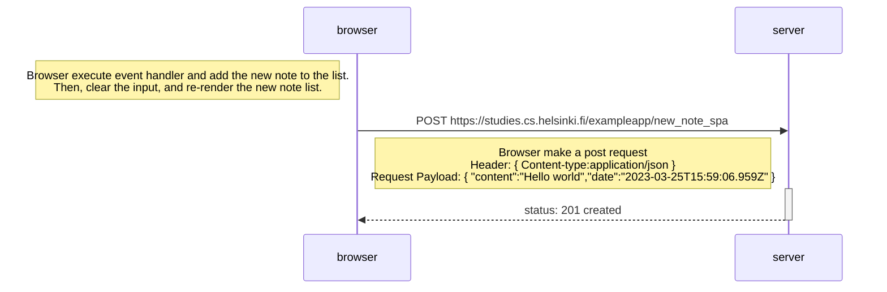

```mermaid
sequenceDiagram
    participant browser
    participant server

    Note left of browser: Browser execute event handler and add the new note to the list.<br/>Then, clear the input, and re-render the new note list.
    browser->>server: POST https://studies.cs.helsinki.fi/exampleapp/new_note_spa
    Note right of browser: Browser make a post request<br/>Header: { Content-type:application/json }<br/>Request Payload: { "content":"Hello world","date":"2023-03-25T15:59:06.959Z" }
    activate server
    server-->>browser: status: 201 created
    deactivate server

    
```